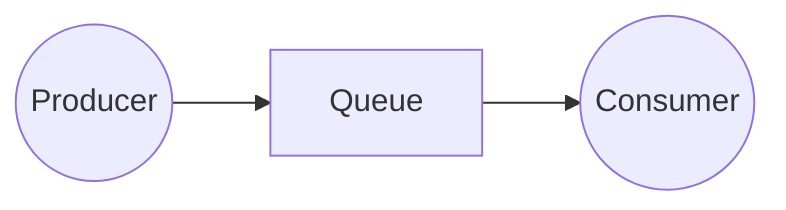
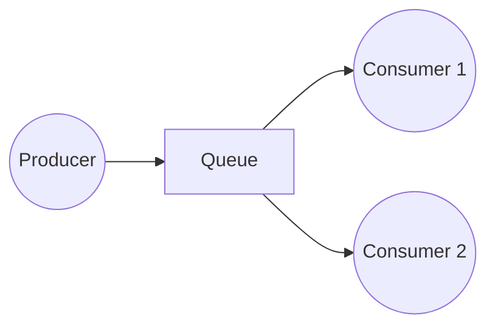

# RabbitMQ + C#
This project has the goal to practice the integration between C# and RabbitMq and the concepts about message broken applications

## Hello World
In this folder you can check out how a simple queue, consumer and producer are created. Nothing is saved on disk for redundancy, also, I did not realized any Acknowledgment procedure to guarantees message reprocessing, the only goal here is send a message and read/consume it.

Queue = Service that takes message from point A and deliver it to point B
Produces = Service that sends message to Queue
Consumer = Service that consumes message from queue

## Work Queues
This folder has the goal to show good practices about messaging services. Those pratics are:

**Acknowledgment process**: This means that if a consumer dies another one will try to process its message.

**Message durability**: This is a set of configurations that you can choose to basically save message in disk for the case your Queue (or RabbitMq) dies you can restore all your pending data and proceeding your process.

### Round-robin
I'll reserve this part to special explain what is this and why this is so important.
RabbitMq has the goal to distribute work load along all the consumers. Lets image the following example:

In this example, we have 2 consumers that "listen" to the same queue. So, what's the best way to balance the quantity of message sent for them both?

Exactly, we can use the principle of rounding robin. Basically it works like this

Message 1 -> Consumer 1
Message 2 -> Consumer 2
Message 3 -> Consumer 1
Message 4 -> Consumer 2

Did you notice the pattern? We are sending to consumer 1 and after to consumer 2. This guarantess that all the consumers will process the same amount of data and the job will be distributed.