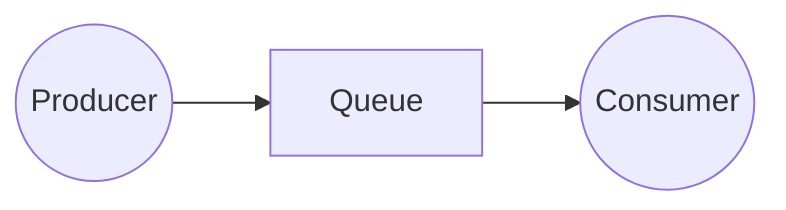
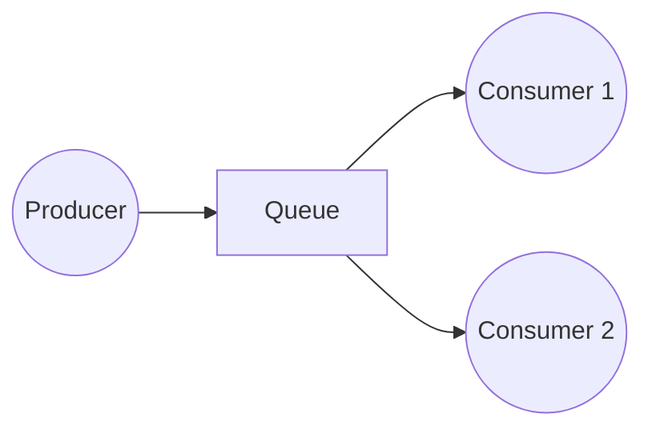
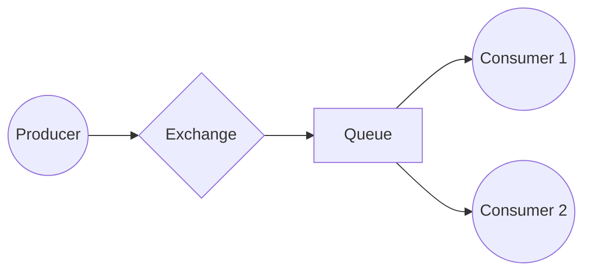
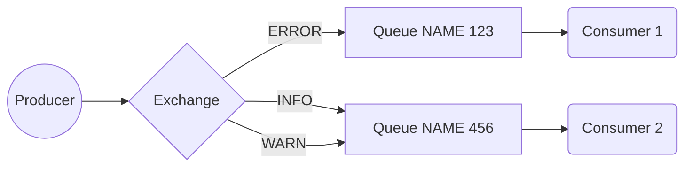

# RabbitMQ + C#
This project has the goal to practice the integration between C# and RabbitMq and the concepts about message broken applications

## Hello World
In this folder you can check out how a simple queue, consumer and producer are created. Nothing is saved on disk for redundancy, also, I did not realized any Acknowledgment procedure to guarantees message reprocessing, the only goal here is send a message and read/consume it.

Queue = Service that takes message from point A and deliver it to point B
Produces = Service that sends message to Queue
Consumer = Service that consumes message from queue

## Work Queues
This folder has the goal to show good practices about messaging services. Those pratics are:

**Acknowledgment process**: This means that if a consumer dies another one will try to process its message.

**Message durability**: This is a set of configurations that you can choose to basically save message in disk for the case your Queue (or RabbitMq) dies you can restore all your pending data and proceeding your process.

### Round-robin
I'll reserve this part to special explain what is this and why this is so important.
RabbitMq has the goal to distribute work load along all the consumers. Lets image the following example:

In this example, we have 2 consumers that "listen" to the same queue. So, what's the best way to balance the quantity of message sent for them both?

Exactly, we can use the principle of rounding robin. Basically it works like this:

Message 1 -> Consumer 1;
Message 2 -> Consumer 2;
Message 3 -> Consumer 1;
Message 4 -> Consumer 2;

Did you notice the pattern? We are sending to consumer 1 and after to consumer 2. This guarantess that all the consumers will process the same amount of data and the job will be distributed.

## Publish/Subscribe

This is a pattern that exists in menssaging, basically it means that 1 publisher will send a message and **all** the consumers will receive it.

This process is also known as "broadcast" (Yes, exactly like network broadcast)

To this be possible, we need to undestand first what is **Exchange**

### Exchange

This works like "Correios" (if you are not from Brazil, "Correios" is a company that sends our mail), the exchange create can have a bunch of types, but in this case we're focus on "Fanout" (This means broadcast mode)

So in practice we are doing:
1. Going to "Correios"
2. Setting up that "Correios" will deliver our message to all the people who is connected to us
3. Send the message to exchange ("Correios")

In practice, we do not post our message in queue, actualy, we put it on exchange, and the exchange will be responsible for redirect our message to the correct queue.

The queue itself is nothing just a "street" that our package will pass through

So the representation of this all is the following:

---

After all of that, we can simply bind our Queue to our exchange

### Binding

Binding in RabbitMQ context means that we have interest in everything that some exchange/queue/routingkey has. 

In Publisher/Subscribe pattern, our goal is to bind the queue to exchange, that means everything that goes out the exchange we'll send to our queues.

## Routing

If you undestand all the Publisher/Subscribe pattern this one will be preatty easy (if you dont understand it, go to this topic first).

Basically, instead of binding the exchange we'll bind the routing key.

*What exactly is a Routing key?*

### Routing Key

To RabbitMQ routing key is a route that the exchange will look to check where it will sends the package. I understand that this is the name of the route (this is not queue name, it actualy the name of the route itself)

You can note in this diagram that we have some route names (INFO, ERROR, WARN) and the name of queus itself. With that diagram, we can conclude that the name of queue and name of route are 2 different things.

---

Based on the previous diagram you can see all the concept of this pattern (Routing), we can use this pattern to segregate some informations if it is necessary